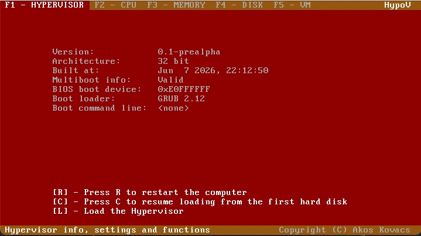
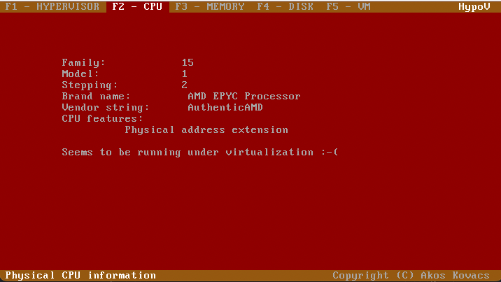
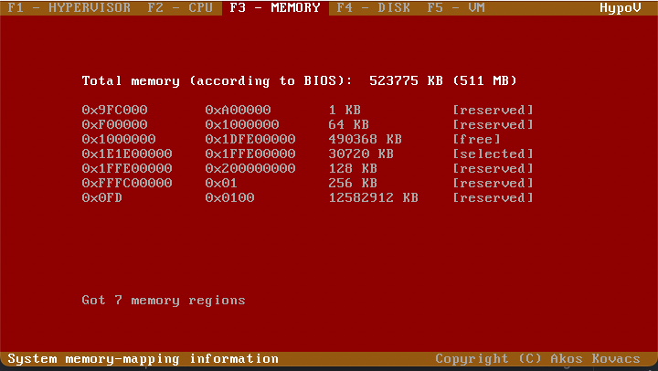

# HypoV [](https://github.com/akoskovacs/HypoV/actions/workflows/build.yml)

64-bit malicious **hypervisor** for funzies.



The project boots via GRUB multiboot into a 32-bit stub that sets up paging and long mode, then decompresses and loads a self-contained 64-bit hypervisor core (`hvcore.elf64`) at a fixed physical address. The 64-bit core has its own GDT, IDT, and interrupt handling.

Once running, the core detects the available virtualization extensions — Intel VT-x (VMX) or AMD-V (SVM) — and can launch and run a real guest operating system (Alpine for testing by default) inside a virtual machine, with nested page tables, intercepted I/O, and emulated legacy peripherals (PIC, PS/2 keyboard).

## Dependencies

### Linux (Debian/Ubuntu)

```sh
sudo apt-get install -y build-essential gcc-i686-linux-gnu binutils-i686-linux-gnu \
    yasm grub-common grub-pc-bin xorriso mtools ruby
```

### macOS (Homebrew)

```sh
brew install i686-elf-gcc i686-elf-binutils i686-elf-grub \
    x86_64-elf-gcc x86_64-elf-binutils yasm xorriso
```

## Building

### Configure

```sh
make menuconfig
```

The default configuration is stored in `.config`. To reset to defaults:

```sh
make defconfig
```

### Compile

**macOS:**
```sh
make
```

**Linux:**
```sh
make CROSS_COMPILE=i686-linux-gnu- GRUB_MKRESCUE=grub-mkrescue
```

### Generate a bootable ISO

**macOS:**
```sh
make iso
```

**Linux:**
```sh
make CROSS_COMPILE=i686-linux-gnu- GRUB_MKRESCUE=grub-mkrescue iso
```

## Running

### QEMU (from ISO)

```sh
qemu-system-x86_64 -boot d -cdrom hypov.iso -m 512 -serial stdio
```

After boot, press **F1** then **L** to load and execute the 64-bit hypervisor core.

### Debug console

Before the hypervisor core is loaded, a 32-bit debug console lets you inspect the host (switch screens with **F1**-**F5**):




### QEMU (shortcut)

```sh
make qemuiso
```

### Running a guest OS

These targets boot HypoV and a guest disk image together, then load the hypervisor (press **F1**, **L**) so the guest starts running inside the VM:

| Target | Guest | Notes |
|---|---|---|
| `make qemuguest` | Alpine Linux | Login `vagrant` / `vagrant`; SSH on `localhost:2222` |
| `make qemuproof` | TinyCore (`hyp_check`) | Runs a hypercall round-trip proof inside the guest |

Run `make qemusvm` to boot HypoV with TCG-emulated AMD-V (works without KVM, e.g. on macOS), or `make qemutcg` for TCG-emulated Intel VT-x. The `*dbg` variants (`make qemudbg`, `make qemusvmdbg`, `make qemutcgdbg`) additionally start a GDB stub (`-S -s`) for remote debugging.

## Project structure

| Path | Description |
|---|---|
| `boot/` | Multiboot entry point and 32-bit chainloader |
| `sys/` | 32-bit kernel: CPU init, memory/paging, ELF loader, debug console |
| `sys/core/` | 64-bit hypervisor core (hvcore): GDT, IDT, interrupt handling |
| `lib/lib32/` | Support library compiled for 32-bit |
| `lib/lib64/` | Support library compiled for 64-bit |
| `lib/drivers/` | VGA character display, serial debug output |
| `scripts/` | Build system scripts and kconfig |
| `etc/grub/` | GRUB configuration for ISO generation |
